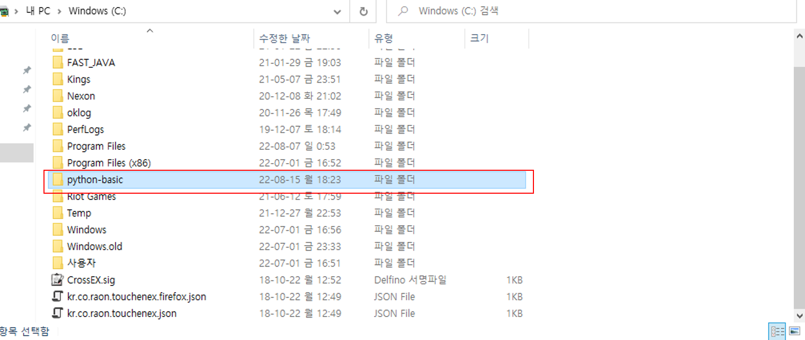

# 03. 가상 환경

## 가상환경 필요성
- 파이썬 버전 호환성
- 프로젝트 관리 용이(추가및 삭제시)
- 패키지 의조성 여부에 따라 파이썬, 또는 패키지 버전이 안 맞으면 실행 안됨 

## 파이썬 가상환경 명령어 기초
- 가상환경 생성
- 가상환경 실행 / 해제 =>(윈도우: Script, 맥 : Bin) 폴더
- 패키깆 설치 및 삭제
- 패키리 리스트 출력
- 패키지 검색

1. 파이썬 가상환경 저장할 폴더 생성

2. python 가상환경 만글기
```
> python -m venv python-basic
```
3. 가상환경 실행
```
> cd ./Scripts
> activate.bat
```

4. 가상환경 빠져 나가기
```
> deactivate.bat
```

## Simplejson 패키기 설치
- 참고 사이트: https://github.com/simplejson/simplejson
1. simplejson 존재 하는지 확인
```
>pip search simplejson
```
2. simplejson 설치
```
> pip install simplejson
```
3. simplejson 설치되었는지 확인
```
> pip list
```

* simplejson 삭제 : pip uninstall simplejosn
* simplejson 버전 최신화 하기" pip --update simplejosn
* simpeljosn 정보 보기: pip show simplejson